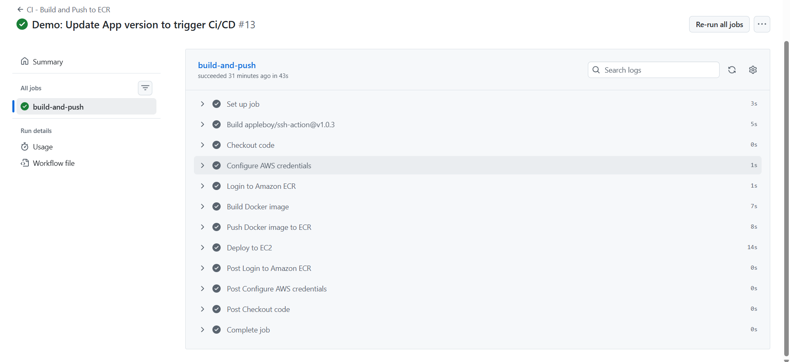

# CloudNative CI/CD Platform 
  

## Overview

This repository contains a small Flask application deployed using an automated CI/CD pipeline. The goal is to show how a code change can move from a Git commit to a running application on AWS with no manual steps on the server.

The application itself is intentionally simple so the focus stays on the deployment workflow.


## Architecture

```
Developer Commit
      |
      v
GitHub Actions
      |
      v
Docker Image Build
      |
      v
Amazon ECR
      |
      v
AWS EC2 (Docker)
      |
      v
Running Application
```


## CI/CD Flow

On every push to the `main` branch:

1. GitHub Actions starts the workflow
2. A Docker image is built from the source code
3. The image is pushed to Amazon ECR
4. The EC2 instance pulls the latest image
5. The running container is replaced

Here's the image of the pipeline for the demo.

<table>
  <tr>
    <td>
      
    </td>
  </tr>
</table>


## Demo

A short demo video showing:

* a small code change
* pipeline execution in GitHub Actions
* the updated application running on EC2

▶️ **Demo video:** [Watch demo](https://drive.google.com/file/d/1oyFkJROeuuMQSFE7kVct7cRGWOc7Lb6i/view)


## Application Endpoints

| Endpoint  | Description                             |
| --------- | --------------------------------------- |
| `/`       | Shows deployment status and app version |
| `/health` | Basic health check                      |

The version shown on `/` is used to confirm that a new deployment has taken place.


## Tech Stack

* Python (Flask)
* GitHub Actions
* Docker
* AWS EC2 and ECR
* Linux


## Repository Structure

```
CloudNative-CI-CD-Platform/
├── app/                 # Application source code
├── docker/              # Docker configuration
├── .github/workflows/   # CI/CD workflow
├── docs/                # Images and notes
└── README.md
```


## Notes

This project focuses on the CI/CD workflow rather than application features. It can be extended further with image tagging, rollback logic, or container orchestration if needed.
